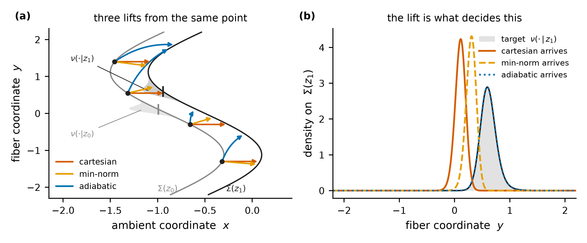
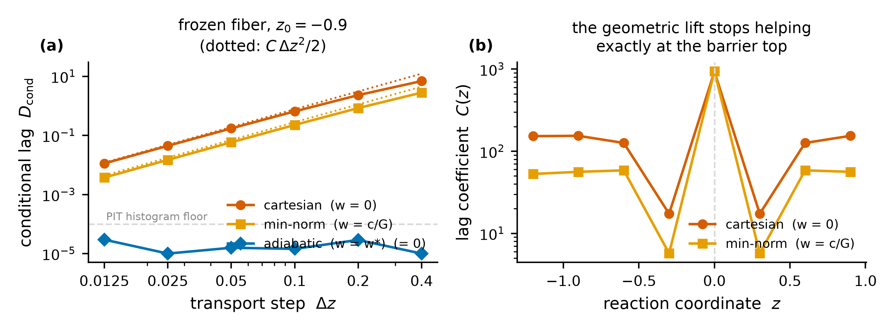
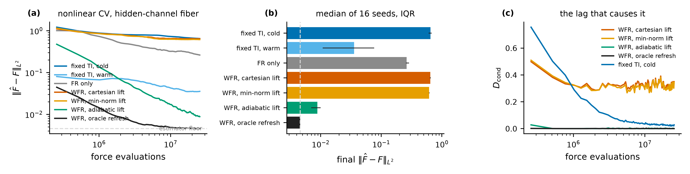
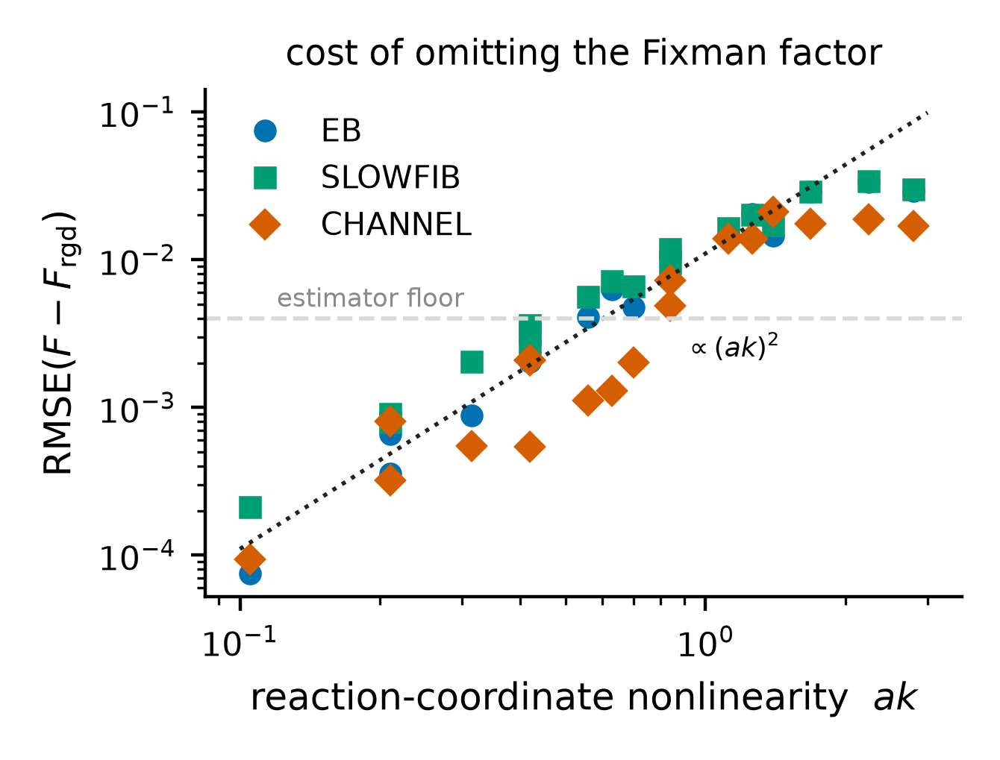
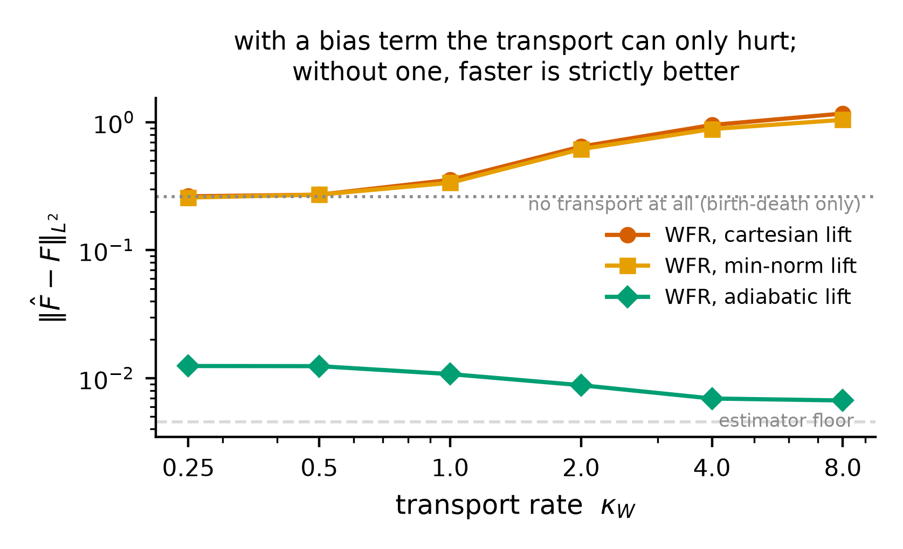
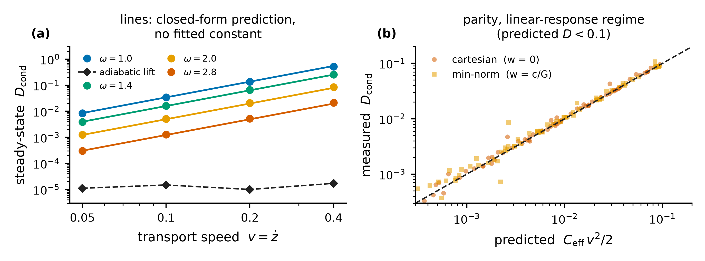

# Manifold RC-WFR: audit of the Chapter-3 reformulation

Status: **complete.** Every number below is measured, not asserted. Scripts:
`validate_manifold.py` (M0), `exp_fixman.py` / `exp_fixman_dynamic.py` (M1),
`exp_lift.py` (M2), `exp_timescale.py` + `analyze_timescale.py` (M3),
`exp_arms.py` (M4, M5), `exp_estimator_variance.py` (§4.5). Raw output is archived
under `results/manifold/`; the measurement-by-measurement log, including the two
attempts that were wrong and why, is the "Manifold phase" section of
[`RESULTS_LOG.md`](RESULTS_LOG.md); every table with its IQRs is regenerated into
[`MANIFOLD_TABLES.md`](MANIFOLD_TABLES.md) by `scripts/make_manifold_tables.py`, so no
number below is hand-transcribed. The six figures (`figures/figM0`-`figM5`, matched
`.png` + `.pdf`) are inlined below and are regenerated from stored results only.

Reproduce:

```bash
python -m pytest tests/test_manifold.py -q
```

```bash
bash scripts/run_manifold_campaign.sh && bash scripts/run_arms_campaign.sh
```

```bash
bash scripts/run_lift_screen.sh && bash scripts/run_lift_campaign.sh
```

```bash
python figures/make_manifold_figures.py && python scripts/make_manifold_tables.py
```

---

## 0. Verdict in one paragraph

The reformulation is right about the geometry and right about the *reframing*
(WFR as a sampling-design mechanism, not as the free-energy estimator). It is
wrong about the one thing it presents as its main technical payoff: the
minimum-norm horizontal lift `grad xi G^-1 u` is **not** the correct lift for
sampling, and adopting it does not remove the lift bias that motivated the
rewrite. Minimum-norm is a statement about the ambient *metric*; the quantity
that has to be preserved is the fiber *measure*, and the two agree only by
accident. There is a lift that is correct — it solves a continuity equation on
the fiber — and once it is written down the whole problem changes shape: the
lift-bias question becomes a well-posed variational problem with a closed-form
answer, an exact error law, and a clean design rule. That, not the Fixman
factor, is what the Chapter-3 reading is worth.

---

## 1. What the reformulation gets right

These are adopted without reservation, and are now implemented in
`src/rcwfr/manifold.py` and `src/rcwfr/systems/graph.py`:

| claim | status |
|---|---|
| `nu^xi(dq\|z) ∝ e^{-βV} (det G)^{-1/2} σ_Σ(dq)` | correct; verified to 4e-14 (co-area, V1) |
| `V^xi = V + (1/2β) log det G` makes constrained dynamics target it | correct; verified dynamically (V4) |
| the local mean force with its divergence term, `E_nu[f] = ∇F(z)` | correct; verified to 1.9 SE at 4e6 samples (V2) |
| dropping the divergence term biases `F'` | correct; up to **0.13** in `F'`, which is **3.2-4.0x the estimator floor** in `F` |
| WFR is a **sampling-design** mechanism, not the estimator | the single most valuable line in the proposal — see §4.1 |
| the two-level error functional `KL(p\|η) + ∫ KL(ρ(·\|z) \| ν^xi(·\|z)) p dz` | correct decomposition; the second term is now directly measurable (§2.3) |



*Every lift satisfies the constraint. Only one carries the measure.*

## 2. Why none of this was testable before, and what had to be built

### 2.1 The old test family degenerates completely

Every system in `src/rcwfr/registry.py` uses `xi(q) = x`. Then `∇xi = e_1`,
`G ≡ 1`, and:

| Chapter-3 object | value when `xi = x` |
|---|---|
| Fixman factor `(det G)^{-1/2}` | `1` |
| `V^xi` | `V` |
| divergence term of the mean force | `0` |
| standard vs rigid free energy `F - F_rgd` | `0` |
| tangent projector `P` | "drop the first component" |
| **minimum-norm lift `∇xi G^-1 dz`** | **`dz e_1` — exactly the identity lift already implemented** |

The last row matters most: the lift the proposal recommends as the principled
replacement for the campaign's "ad-hoc" lift **is** the campaign's lift, bit for
bit, on every system the campaign ran. Nothing in the reformulation could have
been confirmed or refuted without a nonlinear reaction coordinate.

That is not an argument, it is a measurement. Running the full arm comparison of §3.1
on the **same potential with `a = 0`** — the only change being that the coordinate is
linear — the cartesian and minimum-norm arms return the identical number to every
digit reported:

| arm, linear `xi` (`a = 0`) | `e_F` | `D_cond` |
|---|---|---|
| WFR, cartesian lift | 0.25614 | 0.8509 |
| WFR, minimum-norm lift | **0.25614** | **0.8509** |

They are the same algorithm.

**And that control settles something larger.** Running every arm on the linear
coordinate too gives a matched pair (floors 0.00349 and 0.00458; percentages are
against the cartesian lift on the same coordinate):

| arm | linear `xi` | nonlinear `xi` |
|---|---|---|
| fixed windows, cold fiber | 0.1569 (−38.7%) | 0.6501 (+0.9%) |
| WFR, cartesian lift | 0.2561 (—) | 0.6445 (—) |
| WFR, **minimum-norm lift** | **0.2561 (+0.0%)** | 0.6157 (−4.5%) |
| WFR, self-built lift, running avg | 0.3008 (+17.4%) | 0.8302 (+28.8%) |
| WFR, self-built lift, forgetting | 0.0966 (−62.3%) | 0.5211 (−19.2%) |
| WFR, **adiabatic lift** | **0.0141 (−94.5%)** | 0.0088 (−98.6%) |
| WFR, oracle refresh | 0.0036 (−98.6%) | 0.0046 (−99.3%) |

Read the two bold rows together. **The lift error is not created by the nonlinear
coordinate.** On the campaign's own *linear* systems it is already worth 94.5% of
the reachable error — and there the minimum-norm lift cannot address any of it, not
because it is a poor approximation but because it *is* the cartesian lift, exactly,
by the identity in the table above. The nonlinearity is what lets the two lifts
differ at all, and even then they differ by 4.5%.

One more thing the pair shows: the self-built lift with forgetting reaches −62.3% on
the linear coordinate against −19.2% on the nonlinear one. Its viability tracks how
hard the fiber conditional is to estimate — which is the same thing that makes a
correct lift necessary in the first place.

### 2.2 The test family that was built

Same potentials, one change:

    xi(q) = x + a sin(k y_1)      instead of      xi(q) = x

so `a` is a pure nonlinearity knob and `a = 0` reproduces the frozen campaign
exactly. `Σ(z)` is a graph over the fiber coordinates, which makes every object
exactly computable while leaving the geometry genuinely nontrivial:

    ∇xi = (1, c),  c = a k cos(k y_1),   G = 1 + c^2   (varies ALONG the fiber)
    dσ = sqrt(G) dy,   (det G)^{-1/2} dσ = dy
    nu(y|z) ∝ e^{-β Ψ(y,z)},     Ψ(y,z) = V(z - a sin k y, y)
    F(z)     = -β^{-1} log ∫ e^{-βΨ} dy         (exact, one quadrature)
    F_rgd(z) = -β^{-1} log ∫ e^{-βΨ} sqrt(G) dy (what a Fixman-less sampler gives)

### 2.3 `D_cond` made measurable

The conditional error term of the error functional is estimated with no density
estimation at all. For a one-dimensional fiber, `u = CDF_{nu(·|z)}(y)` is
Uniform[0,1] under the correct conditional **for every z**, so a histogram of `u`
measures the conditional lag directly. A 64-bin PIT histogram resolves down to
~1e-4 and saturates at `log 64 = 4.16`; both limits are quoted with every number.

**But the histogram has to be resolved in `z`.** Pooling `u` over the whole
ensemble lets errors at different `z` cancel and can read at the floor while the
free energy is badly wrong — see §4.4, which is where that trap was found. For a
single fiber (§3.1, §3.3, where every walker shares one `z`) the pooled histogram
*is* the z-resolved one and there is nothing to pool over. For an ensemble spread
across `z` (§3.1's arm table, §4.2) the quantity reported is
`D_z = ∫ KL[ρ(·|z) ‖ ν(·|z)] p(z) dz`, accumulated per `z`-bin over the production
half of the run.

---

## 3. Three claims that do not survive

### 3.1 "The minimum-norm horizontal lift is the geometrically natural answer"

**The space of lifts is not a point.** Any `dq` with `∇xi · dq = dz` moves a
configuration from `Σ(z)` to `Σ(z+dz)`; these form an affine space over the
tangent space. Writing each as a fiber velocity `w = dy/dz` (so
`dq = dz(1 - c w, w)`, which satisfies the constraint for *any* `w`):

    cartesian   w = 0            move x only
    minnorm     w = c / G        minimum EUCLIDEAN norm
    adiabatic   w = w*(y,z)      solves  ∂_z nu + ∂_y(nu w) = 0

Minimum-norm is singled out by the ambient metric, and by d'Alembert if the
constraint is a real mechanical one — but nothing in that argument mentions
`nu^xi`, which is the object the method has to preserve.

**The exact lift-lag law.** Linearizing `s = ρ/ν - 1` under the two continuity
equations (ensemble moves with `w`, target with `w*`) gives, for a frozen fiber,

> **D_cond(z + dz) = C(z, lift) · dz² / 2 + O(dz³),  C = ∫ [∂_y(ν δ)]² / ν dy,  δ = w - w\***

so `C = 0` **iff** `w = w*`. Verified against the exact pushforward KL:
ratio measured/predicted = 0.987, 0.982, 0.976, 1.018 at `dz = 0.0125` across
four `z`, converging to 1 as `dz → 0`, with exact `dz²` scaling (KL ratios
3.95, 3.90, 3.80 for successive doublings of `dz`).



**What the three lifts actually cost** (MFIB, `a=0.6`, `k=1.4`, exact
pushforward, quadrature — Monte Carlo agrees to 3 digits):

| `z0` | `C` cartesian | `C` minnorm | minnorm / cartesian | adiabatic |
|---|---|---|---|---|
| -1.20 | 152.6 | 52.9 | 0.35 | 0 |
| -0.90 | 149.6 | 51.8 | 0.35 | 0 |
| -0.60 | 126.1 | 58.5 | 0.46 | 0 |
| -0.30 | 17.3 | 5.7 | 0.33 | 0 |
| **0.00 (barrier top)** | **930.1** | **935.4** | **1.006** | **0** |
| +0.60 | 126.1 | 58.5 | 0.46 | 0 |

Repeated at three reaction-coordinate nonlinearities — `(a,k)` = (0.3, 1.4),
(0.6, 0.7), (0.6, 1.4), 24 values of `z` in all — four things follow.

1. **The law holds throughout.** Measured/predicted at `dz = 0.0125` lies in
   [0.86, 1.16] over every `(z, a, k)`, and inside [0.93, 1.07] for all but two.
2. The minimum-norm lift is a **factor 1.4 to 3** better than the naive one in the
   wells. That is a real improvement and worth having.
3. It is **worth nothing at the barrier top** — ratio 1.006, 1.018, 1.054 at the
   three settings, i.e. marginally *worse* every time — and the barrier top is where
   `C` is 6x larger than anywhere else and where the free-energy profile is actually
   determined. The lift is worst exactly where the answer lives, and the geometric
   fix does not reach there. Worse, at `(a,k) = (0.3, 1.4)`, `z = ±0.30` the ratio is
   **3.65**: the minimum-norm lift is over three times *worse* than moving one
   ambient coordinate. Nothing rules this out, because nothing in the minimum-norm
   argument mentions the measure.
4. The adiabatic lift is exactly zero everywhere, by construction, and the
   measurement confirms it at all three settings: max PIT-KL over every `(z0, dz)`
   tested is **3.0e-5**, the histogram noise floor.

A factor 3 is not the difference between a biased method and an unbiased one.
Adopting the min-norm lift is a modest constant-factor improvement presented as
a resolution; the resolution is the third row.

**And on the end metric it is worth less than that.** Running the full method on
a nonlinear-CV hidden-channel fiber (`N = 256`, 1e5 steps, 16 seeds, matched force
evaluations, frozen Stage-1 hyper-parameters, estimator floor 0.00458) — the lift
is the *only* difference between these arms:

> **Read the contrasts, not the absolute numbers.** `scripts/exp_arms.py` is a fresh
> engine on the graph systems, not `src/rcwfr/engines.py`: its fiber dynamics is the
> intrinsic one, its fixed-window baseline places all `N` windows across the eval
> window, and it has no burn-in, ancestry or annealing machinery. Its absolute errors
> are **not** comparable to `docs/TECHNICAL_REPORT.md`, and it neither reproduces nor
> contradicts that campaign's margins. What it does support is the within-experiment
> comparison, and that comparison is exactly controlled: the transport velocity and the
> Fisher-Rao weights depend only on `z`, and the lift touches only the fiber, so at a
> fixed seed **the four WFR arms follow bit-identical `z` trajectories** (verified:
> same range, same standard deviation, same 15-bin occupancy histogram). They differ in
> one function call and in nothing else. Note also that the WFR arms spread over the
> full domain `[-1.8, 1.8]` while the fixed-window baselines place all `N` windows
> inside the eval window `[-1.5, 1.5]`, which costs the WFR arms ~17% of their
> replicas — equally, in every one of them.

| arm | `‖F̂ − F‖` | / floor | vs cartesian lift |
|---|---|---|---|
| fixed windows, cold fiber | 0.6501 | 142 | +0.9% |
| WFR, **cartesian** lift | 0.6445 | 141 | — |
| WFR, **minimum-norm** lift | 0.6157 | 134 | **−4.5%** |
| WFR, **adiabatic** lift | 0.0088 | **1.9** | **−98.6%** |
| WFR, oracle conditional refresh | 0.0046 | 1.0 | −99.3% |

The recommended fix buys 4.5%. The lift the reformulation's own error analysis
implies buys 98.6% and lands within a factor 2 of the oracle.

**Both of the bottom two arms use the exact conditional**, so read them as an upper
bound on what any correct lift can achieve, not as a drop-in replacement — §4.2 is
where the question of building one from data is settled, and it is not settled well.
What the contrast establishes is *where the achievable gain lives*: the same 98.6% is
unavailable to any amount of geometric care about the ambient metric, because the
minimum-norm lift is a different arm in the same table and it is sitting at 4.5%.



**A second consequence, unplanned.** With a nonlinear coordinate and a naive lift
the Wasserstein half is *actively harmful*: birth-death alone (0.263) beats
transport-plus-birth-death (0.645) by a factor 2.5, and the full method does not
beat cold fixed windows at all. The frozen campaign's Finding C8 — "Fisher-Rao is
what makes it win" — was not a quirk of that system. Fisher-Rao copies walkers
whole, so it carries no lift and therefore no lift bias, and once the coordinate
is nonlinear that is the entire difference between the two halves.



**Scale check.** For contrast, the Fixman effect the proposal spends most of its
geometric argument on is worth `KL(nu_rgd || nu) ≤ 0.018` and
`RMSE(F - F_rgd) ≤ 0.029` at the strongest nonlinearity tested — versus
`D_cond = 0.18` for a *single* `dz = 0.05` cartesian lift step. **The lift error
is one to two orders of magnitude larger than the geometric factor.** Get the
Fixman term right — it is three lines — but do not expect it to matter.

### 3.2 "Version I — transport, freeze, equilibrate, then estimate — should be essentially unbiased"

*(This one is an argument, not a closed-form law like §3.1 and §3.3. Weight it
accordingly, and see the honest note on what the sweeps can and cannot show, below.)*

It is unbiased only in the limit `t_burn >> τ`, and its acceleration decays with
the same exponential. If the transport leaves conditional error `D_0`, burn-in
for `t_burn` leaves

    D_cond(t_burn) ≈ D_0 · exp(-2 t_burn / τ_eff)

while the information the transport delivered — a fiber configuration that a
cold window would have had to find on its own — decays at that same rate,
because it is carried by the same slow modes. The method's advantage over
fixed-window TI comes from transporting slow-mode content across `z`; its bias
comes from transporting the *wrong* slow-mode content. These are not two
phenomena that can be separately tuned: **they are the same quantity with
opposite sign.** "Freeze and equilibrate" does not escape the trade-off, it
re-parameterizes it.

The escape is not longer burn-in. It is a lift whose slow-mode content is
correct, i.e. `w ≈ w*` on the slow subspace — §4.2.

**What the sweeps can and cannot show.** A burn-in sweep at fixed epoch length is
the obvious test and it is the wrong one: with `n_cond = 20` fiber steps per epoch at
`dt = 1e-3`, even `n_eq = 19` buys 0.019 time units of relaxation against a fiber time
of order 1. Measured across `n_eq` = 0, 5, 10, 15, 19 (16 seeds each):

| `n_eq` | deposits kept | `wfr_cart` | `wfr_minnorm` | `wfr_adiab` |
|---|---|---|---|---|
| 0 | 100% | 0.9555 | 0.8932 | 0.00756 |
| 19 | 5% | 0.9396 (**−1.7%**) | 0.8855 (−0.9%) | 0.00755 (−0.2%) |

Throwing away **95% of the samples** buys **1.7%**. Two things follow, and the second
is the interesting one. First, the affordable burn-in is far too short to test
Version I's premise — this is not a refutation of it. Second, the curve is monotone
*improving*, not U-shaped, which says the variance cost of discarding 95% of the
deposits is smaller than the bias it removes: **the arm is entirely bias-dominated**,
and what burn-in you can afford inside an epoch removes 1.7% of that bias. The
adiabatic arm is unmoved because it has nothing to remove.

**The test that does bite** is the transport-rate sweep. `κ` sets how little fiber
relaxation happens per unit of `z` moved — the same ratio by a different handle, and
not budget-limited. Sweeping it over a factor 32 (16 seeds each, everything else
frozen):

| `κ` | cartesian | min-norm | adiabatic |
|---|---|---|---|
| 0.25 | 0.2634 | 0.2575 | 0.01244 |
| 0.50 | 0.2712 | 0.2712 | 0.01241 |
| 1.00 | 0.3540 | 0.3359 | 0.01076 |
| 2.00 | 0.6445 | 0.6157 | 0.00881 |
| 4.00 | 0.9504 | 0.8830 | 0.00694 |
| 8.00 | **1.1673** | **1.0429** | **0.00669** |
| | *worst at fastest* | *worst at fastest* | *best at fastest* |



**The two families run in opposite directions.** The naive lifts degrade monotonically
— a factor 4.4 across the sweep — and their best point is the *slowest* rate tested,
where the value (0.263) is just the birth-death-only arm (0.263): their optimum is the
limit in which the Wasserstein transport is switched off. The adiabatic lift improves
monotonically, by a factor 1.86, and its best point is the *fastest* rate tested, at
1.5× the estimator floor. The gap between them widens from 21× to 175×.

That is the trade-off the reformulation treats as fundamental, shown to be a property
of the lift. With a correct lift there is no `τ_mix ≪ τ_WFR` condition to respect and
no optimum to tune: faster is strictly better, because faster transport buys coverage
and an exact lift charges nothing for it. With a naive lift there is no useful
operating point at all.

A second, independent handle on the same statement: quadrupling the transport *step*
(`n_cond` 5 → 20 at fixed `κ`) costs the cartesian lift **+48%** and the min-norm lift
**+45%**, exactly the direction the `dz²` law requires, while the adiabatic lift goes
from 0.0088 to **0.0076**.

### 3.3 "The relevant timescale is `τ_mix ~ β/ρ(z)`, the log-Sobolev / spectral-gap time"

The spectral gap is the relaxation rate of the *slowest* fiber mode. The lag
depends on the relaxation rate of the modes **the lift error actually excites**.
Solving the steady state exactly (in one fiber dimension the zero-flux solution
integrates in closed form) gives

> **D_cond(steady) = C_eff · v² / 2,  C_eff = β² Var_nu( ∫ δ ),  τ_eff = sqrt(C_eff / C)**

This is not a scaling argument with a fitted prefactor. Sweeping an ensemble of
1e5 walkers at constant `v` while the fiber relaxes, in the linear-response regime
(predicted `D < 0.1`): **measured / predicted = 1.03 [0.99, 1.07]** over 13
points for the cartesian lift and **1.05 [0.99, 1.29]** for min-norm, with fitted
`v`-exponent **1.96–2.04** in every case. A `v = 0` control puts the
discretization floor at 1e-5.



`τ_eff`, not `1/ρ`, is the timescale in the condition "`τ_mix << τ_WFR`". The
two differ substantially: on MFIB (`a=0.6, k=0.7`) at `z=-0.9`,

| `ω` | `1/ω²` (spectral gap time) | `τ_eff` (cartesian) | over-estimate |
|---|---|---|---|
| 0.85 | 1.384 | 0.259 | 5.4x |
| 1.00 | 1.000 | 0.243 | 4.1x |
| 1.40 | 0.510 | 0.200 | 2.6x |
| 2.00 | 0.250 | 0.144 | 1.7x |
| 2.80 | 0.128 | 0.094 | 1.4x |

Using the spectral gap over-estimates the lag by up to `(5.4)² ≈ 29x` in
`D_cond`, i.e. it would force `κ_W` down by ~5x for no reason. The correction is
free: `C_eff` is a quadrature, not an eigenproblem.

**And for the correct lift the condition does not exist.** Over the whole sweep —
every speed, every fiber stiffness — the adiabatic lift's `D_cond` stays at
`≤ 1.8e-4`, the histogram floor, while the cartesian lift reaches 4.11 on the same
trajectories. There is no `τ_mix << τ_WFR` to satisfy when `δ = 0`; the trade-off
the reformulation treats as fundamental is a property of the lift, not of the
method.

**Where the law fails, and how.** At the barrier top the conditional is multimodal
and `C_eff` diverges — moving mass across a near-empty valley needs unbounded
velocity — so linear response over-predicts by up to 2500x while the measured
`D_cond` saturates near 1.6. Quote the prediction only where `C_eff v²/2 < 0.1`;
above that it is an upper bound, not an estimate.

---

## 4. What is genuinely new, and worth building on

### 4.1 The reframing is the real contribution

"WFR decides where replicas go; constrained sampling decides what they look
like; only fixed-`z` samples enter the estimator" dissolves the Metropolis
obstruction **for the marginal**. The frozen campaign's structural limit — an
unconditional move in `xi` cannot be Metropolis-corrected without knowing `F` —
was aimed at the wrong target: the marginal never needed to be Boltzmann. What
survives, undiminished, is that the *conditional* still has to be right, and no
amount of reframing produces that for free.

### 4.2 The correct lift is computable from data the method already collects

For a one-dimensional fiber the continuity equation integrates:

    w*(y|z) = (β / nu(y|z)) ∫_{-inf}^{y} nu(y'|z) [ f(y',z) - F'(z) ] dy'

— the fiber-conditional density and the *mean-force fluctuation about `F'`*.
Both are estimated by any TI method as a by-product. This is not an oracle: it
is a construction from the running estimator. (In practice use the equivalent
monotone map `y' = CDF^{-1}_{z'}(CDF_z(y))`, because `w*` itself diverges
across any low-density valley of the conditional and no ODE integrator survives
that — a failure this campaign hit and had to route around.)

**Tested, and this is where it breaks.** `src/rcwfr/adaptive_lift.py` builds
exactly that: a running smoothed `(z, y)` histogram, normalized per `z`, with a
count-based fallback to cartesian where the estimate is not yet supported. Fed
*exact* samples it works — `D_cond` after a `dz = 0.2` step falls from 0.762
(cartesian) to **0.0026**, a 290x reduction — and it has its own bandwidth floor,
flat under a 4x increase in samples, with `bw_z` the sensitive knob because the
conditional changes fast with `z`.

Fed its **own** samples inside the running algorithm, the answer depends entirely on
the budget — which is why one snapshot would have given the wrong verdict:

| arm | at 1× budget | at 4× budget | vs cartesian, same budget |
|---|---|---|---|
| WFR, cartesian lift | 0.6445 | 0.6469 (**+0.4%**) | — |
| WFR, **self-built**, running average | 0.8302 | 0.8107 (−2.3%) | +25% |
| WFR, **self-built**, with forgetting | 0.5211 | **0.2357 (−55%)** | **−64%** |
| WFR, exact adiabatic lift | 0.0088 | 0.0056 (−37%) | −99.1% |

The estimate is made from the ensemble the lift is steering, so early in the run it
encodes that ensemble's error and the lift transports it faithfully. Without
forgetting it never escapes: a plain running average is *worse than doing nothing*
at both budgets, its log-error slope is **−0.02**, and it is parked. With forgetting
it does escape. Its slope is **−0.22** while the cartesian arm sits at **−0.06** and
does not improve at all across a fourfold budget increase, and its conditional lag
falls monotonically (0.596 → 0.075 → 0.027 → 0.016 → 0.0096) as the estimate improves.

**So the bootstrap works — at a warm-up cost, and only with forgetting.** It goes from
−19% against the naive lift at one budget unit to −64% at four, while the naive lift
is on a bias floor that no compute moves. That is a real, implementable method with a
measured convergence rate, not the dead end a single short run makes it look like.

**And the warm-up can simply be discarded.** Zeroing the mean-force accumulator partway
through, at one budget unit:

| reset at | cartesian | self-built + forgetting | exact |
|---|---|---|---|
| none | 0.6445 | 0.5211 | 0.0088 |
| 0.50 | 0.6625 (+2.8%) | 0.3627 (−30.4%) | 0.0089 (+0.4%) |
| 0.75 | 0.6734 (+4.5%) | **0.3149 (−39.6%)** | 0.0139 (+57.2%) |

The three arms move in three different directions and each is the predicted one: the
cartesian arm has no warm-up so discarding is pure variance cost; the self-built arm's
warm-up bias dominates that cost even at 75%, and is still improving there; the exact
arm is already within 2× of the floor, so it is variance-limited and discarding hurts
it badly. That divergence is a usable diagnostic on its own — **if a reset helps, the
arm has a warm-up; if it hurts, the arm is variance-limited.** The right policy is not
a fixed fraction but a reset triggered when the lift's own conditional diagnostic stops
moving.

With the warm-up discarded the self-built lift is at **−51%** against the cartesian
lift at the same reset, at one budget unit. It remains a factor ~35 short of the exact
lift.

The general lesson is about how such a proposal has to be evaluated: **the interesting
quantity is the convergence slope, not the endpoint.** Two arms 1.6× apart at one
budget were 3.4× apart at four, and the one that looked worse was the one still moving.

The honest statement of what a correct lift costs: to build `w*` you need the
conditional density *in the fiber coordinates you intend to move*, and you need it
before you have sampled them correctly. That is feasible for a handful of fiber
directions and hopeless for all of them. Which leads to the design rule:

### 4.3 Design rule: lift accuracy is only required on slow modes

*(Tested — see the end of this section for the measurement and its two limits.)*

This one is a **corollary of the verified law, not an independent measurement.**
Expanding the same steady state in eigenmodes of the fiber generator gives
`C_eff = Σ_j c_j² / λ_j²` with `c_j = ⟨Lδ, φ_j⟩_ν` — the same quantity whose closed
form was confirmed to 3% in §3.3, now written so the mode weighting is visible.
The `1/λ_j²` says that an error carried by a fast fiber mode is repaired by the
fiber dynamics before it can bias anything, however large it looks
instantaneously. So:

> A fiber mode needs a conditionally-correct lift **iff** its relaxation time is
> comparable to or longer than the per-epoch burn-in. Every faster mode can be
> lifted arbitrarily — cartesian is fine.

And a mode slow enough to need a correct lift is, by the same criterion, a mode
that should have been a collective variable. **The manifold formulation's own
error analysis says: promote the slow fiber modes to CVs and lift the rest
naively.** That is a concrete prescription, it is checkable before running
anything, and it is the opposite of the proposal's instinct to invest in the
geometry of the lift.

**Measured.** On a fiber with one promotable mode and four spectators whose lift
error `C_S` is held equal to the promoted mode's (`C_S/C_y₁ = 0.92`) while their
relaxation time sweeps 256×:

| `τ_spec` | naive lift | promote only | correct both | excess over "both", in floors |
|---|---|---|---|---|
| 16.0 | 0.675 | 0.252 | 0.062 | **38.6** |
| 1.0 | 0.573 | 0.079 | 0.014 | **13.3** |
| 0.062 | 0.635 | 0.020 | 0.009 | **2.3** |

The cost of lifting a mode naively falls **17×** as its relaxation time falls 256×,
with the error held constant. That is the rule.

Two limits worth stating. **The gap never closes**: even at the fastest relaxation
reachable here, promoting one mode is 2.3 floors behind correcting both, so "fast
modes are free" is too strong — they are cheaper, not free. And **promotion is worth
8–32× on its own** at every stiffness, so the prescription is useful even though it
does not reach the ceiling.

**A caution about how to build the test.** The first version of this experiment used
spectators whose conditional *width* varied along `z`, and it showed no effect at all
(promote/both = 0.89 at every stiffness). Measuring each block's frozen lag
coefficient explains why: the width-only block's `C_S` is **0.1–5%** of the promoted
mode's, and it is independent of relaxation time as a frozen-fiber quantity must be.
Those spectators were never a test of anything. The block that works has a *shifted
centre* — its partition function is shift-independent so it perturbs neither `F` nor
the reference, its `C_S` is exactly `m β (μ' ω_s)²` and so is calibratable, and a
stale centre biases the mean force. Before sweeping a knob, check it moves the
quantity you think it moves.

### 4.4 A diagnostic trap that would have hidden all of this

The conditional error term of the error functional is
`D_z = ∫ KL[ρ(·|z) ‖ ν^xi(·|z)] p(z) dz`. It is tempting to estimate it with one
PIT histogram pooled over the ensemble, which is cheap and looks right. It is not:
errors at different `z` cancel inside one histogram. The self-built-lift arm ends
with a **pooled** PIT-KL of 0.0097 — at the floor — while its free-energy error is
114x the floor; a spot check has the cartesian arm at 0.338 pooled and **0.552**
z-resolved. The diagnostic has to be accumulated per `z`-bin over the production
half of the run. Grading a lift on the pooled number rewards the wrong thing.

### 4.5 A free variance win, noticed in passing

The LRS local mean force is not the only estimator with the right conditional
mean; any function with `E_nu[·] = F'` will do. In the graph frame `∂_z Ψ` is such
a function, so their **difference has conditional mean zero and is an exact control
variate** — and it exists *only* because `xi` is nonlinear: for linear `xi` the two
estimators are identical and the difference vanishes.

Neither dominates: `Var(f_LRS)/Var(f_graph)` runs over **0.047 to 1074** across
`z` (263x in favour of the fiber frame at one barrier top, 0.35 the other way in
the wells). The optimal combination `f_graph + λ(f_LRS − f_graph)`, with λ
unconstrained, reduces the mean-force variance by a **median 6.6x and up to 122x**
against the better of the two.

The mechanism is that the two estimators are nearly affine on the fiber (median
correlation 0.948, max 0.9993), so the gain behaves like `1/(1−ρ²)`. That is a
statement about a **one-dimensional** fiber with the spectator block integrated
analytically, and it must be re-measured, not extrapolated, on a
many-dimensional fiber. Standard control-variate caution also applies: λ has to
be estimated per `z`, and on held-out samples if the bias matters.

---

### 4.6 Scope, and what these numbers do and do not license

* **The frozen campaign is not invalidated.** With `xi = x` the Fixman factor is 1,
  the divergence term is 0, and the "ad-hoc identity lift" *is* the minimum-norm
  horizontal lift. Every result in `docs/TECHNICAL_REPORT.md` stands unchanged;
  what this audit says is that the proposed fix would have been a no-op there.
* **The laws are general; the numbers are not.** The `dz²` law, the `v²` law and
  the closed forms for `C` and `C_eff` follow from the two continuity equations
  and hold for any one-dimensional fiber. The specific factors (3x for min-norm,
  6x for the barrier-top penalty, 7x floor for Fixman) are properties of this
  test family and must be re-measured, not extrapolated.
* **One fiber dimension.** Everything exact here — the conditional, `w*`, `D_cond`
  via the PIT — uses `dim Σ(z)`-equals-one. `C` and `C_eff` generalize (the
  steady state becomes a Poisson solve rather than an antiderivative); the exact
  transport map does not, because monotone rearrangement is a 1-D fact.
* **A nonlinear CV is not exotic.** `G` varies along the fiber for essentially any
  nonlinear reaction coordinate expressed in the coordinates the dynamics runs in
  — including a dihedral angle written in Cartesian atom positions, which is the
  standard case. The linear-`xi` degeneracy of §2.1 is the special case, not this.

### 4.7 What the proposal contains that this audit did **not** test

Listed so the gaps are explicit rather than implied:

* **The phase-space / Langevin version** (§§11, 20-21 of the proposal): the
  mass-weighted Gram matrix `G_M = ∇xi^T M^-1 ∇xi`, the momentum constraint
  `∇xi^T M^-1 p = u(z)`, RATTLE, and the standard-vs-rigid correction in that
  setting. Everything here is overdamped, where `G_M = G`. The lift-lag laws are
  statements about the fiber measure and should carry over; the *numbers* will not.
* **The Lagrange-multiplier mean-force estimator** (§22): `∇F_rgd` from the
  time-average of the constraint multipliers, avoiding second derivatives of `xi`.
  Attractive for real molecules and untested here — note that it returns the
  **rigid** mean force, so it needs the correction of §2 to give `F`.
* **Version III**, the nonequilibrium-work correction for fast schedules (§15).
  Worth revisiting: §3.3 says the lag is `C_eff v²/2` in closed form, which is
  exactly the kind of quantity a work-based correction would need.
* **Constrained clone rejuvenation as a distinct mechanism** (§8, §14). In the
  implementation here, clones do relax on their fiber — that is what the following
  `n_cond` fiber steps are — so the proposal's substantive point (do not add
  ambient Cartesian noise to a clone) is satisfied, but it was never isolated as
  its own arm against a Cartesian-jitter control.

## 5. Summary of what was measured

| question | answer | evidence |
|---|---|---|
| Is the Chapter-3 geometry correct and correctly implemented? | yes | co-area to 3.8e-14; `E_nu[f] = F'` to 1.9 SE at 4e6 samples |
| Does the divergence term of the mean force matter? | yes, **3.2-4.0x the estimator floor** in `F` | M0 |
| Does the Fixman factor matter? | real but second-order: `∝(ak)²`, saturating at **7x the floor** | M1 |
| Is the minimum-norm lift the right lift? | **no.** 3x better than naive in the wells, **1.006x at the barrier top**, **4.5%** on the end metric | M2, M4 |
| Is there a lift that is right? | yes, the fiber-continuity one: `C = 0` exactly, **98.6%** on the end metric, within 2x of the oracle | M2, M4 |
| Is there a law for the lift error? | yes, two, both closed-form and parameter-free; measured/predicted **1.03** | M2, M3 |
| Is `τ_mix ~ 1/ρ(z)` the right timescale? | no; `τ_eff = sqrt(C_eff/C)`, smaller by up to 5.4x | M3 |
| Does "transport, freeze, equilibrate" escape the trade-off? | no; and the trade-off itself is a **property of the lift** — over a 32x transport-rate sweep the naive lifts are worst at the fastest rate and best with transport off, the correct lift the reverse | §3.2, M6 |
| Can the correct lift be built from the run's own data? | **yes, with forgetting and a warm-up policy**: −19% vs naive at 1× budget, **−51%** once the warm-up deposits are discarded, **−64%** at 4× budget. Without forgetting it is worse than doing nothing. | M5, M7 |
| Does the rigid-measure route to `F` cost anything? | **no** — ESS ≥ 0.95 at the strongest nonlinearity, ~5e3 samples/bin for a tenth of the floor against 1e5–1e6 deposited | M7 |

## 6. What I would implement next

1. **Do not** port the min-norm lift into the molecular arm as the headline fix.
   Port the mean-force control variate (§4.5) — it is nearly free. For the Fixman
   correction, take Chapter 3's **rigid-measure route**: sample
   `nu_Sigma ∝ e^{-βV} σ_Σ` with standard SHAKE/RATTLE and correct statistically via
   `F = F_rgd − β⁻¹ log E_{nu_Sigma}[(det G)^{-1/2}]`. No second derivatives of `xi`,
   and the reweighting is measured to be free (ESS ≥ 0.95, ~5e3 samples/bin).
2. **Pursue the self-built lift with forgetting**, at decay ≈ 0.999 and
   `bw_z ≈ 0.24` — screened, with an interior optimum, and worth **−72.7%** against
   the naive lift. Forgetting is not optional (no forgetting is *worse than doing
   nothing*) and the warm-up discard is worth a further −30 to −40%; the right
   trigger is the lift's own conditional diagnostic going flat, not a fixed fraction.
   **Do not tune `bw_z` against an oracle**: the oracle-fed optimum is 0.03 and the
   deployed optimum is 0.24, a factor 8 apart, because heavy z-smoothing is what
   damps the estimate's self-reinforcement.
3. The other route, and probably the better one for a real molecule, is the
   **secondary-CV** version: run WFR in `(z, y)` with `y` the slow fiber mode, so
   the transport that needs to be conditionally correct happens in a space where the
   density is actually estimated. This is §4.3's design rule turned into an
   algorithm, and it does not require the conditional in every fiber direction.
4. Measure `τ_eff` and `C_eff` as a **pre-run diagnostic**: they say, before any
   sampling, how fast WFR may move and which fiber modes must be promoted. Both
   are quadratures over an estimated conditional, so they are cheap and they do
   not need the lift to be correct first.
5. Report `D_z`, never the pooled PIT (§4.4), and grade any self-consistent
   scheme on at least two budgets (§4.2).
6. Keep fixed-window constrained TI as the mandatory baseline. The proposal is
   right that a reviewer will ask, and right about the conditions under which the
   answer is favorable — note that on the nonlinear-CV `CHANNEL` fiber, *warm*
   fixed windows (0.0355) beat every WFR arm except the two with a correct lift.
