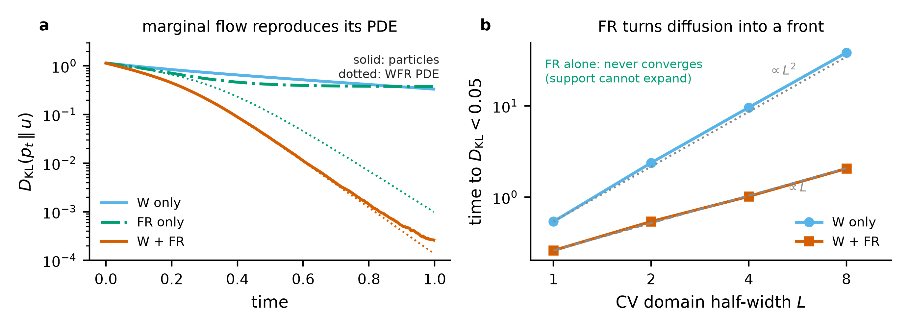
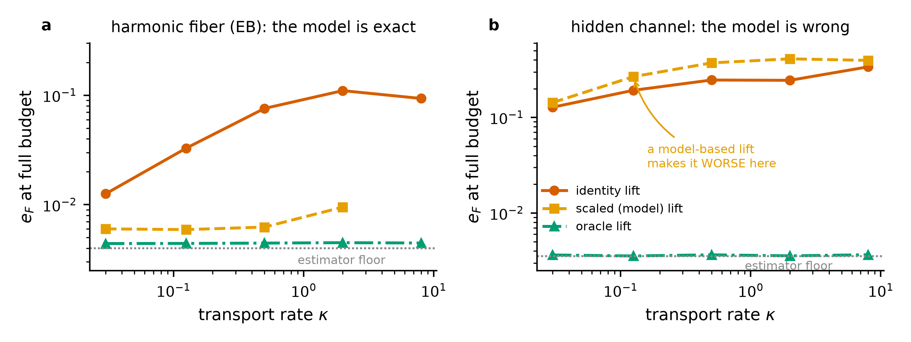
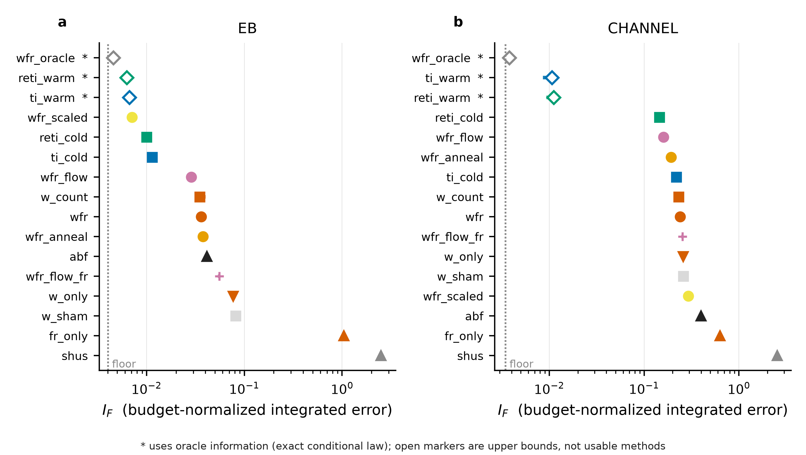
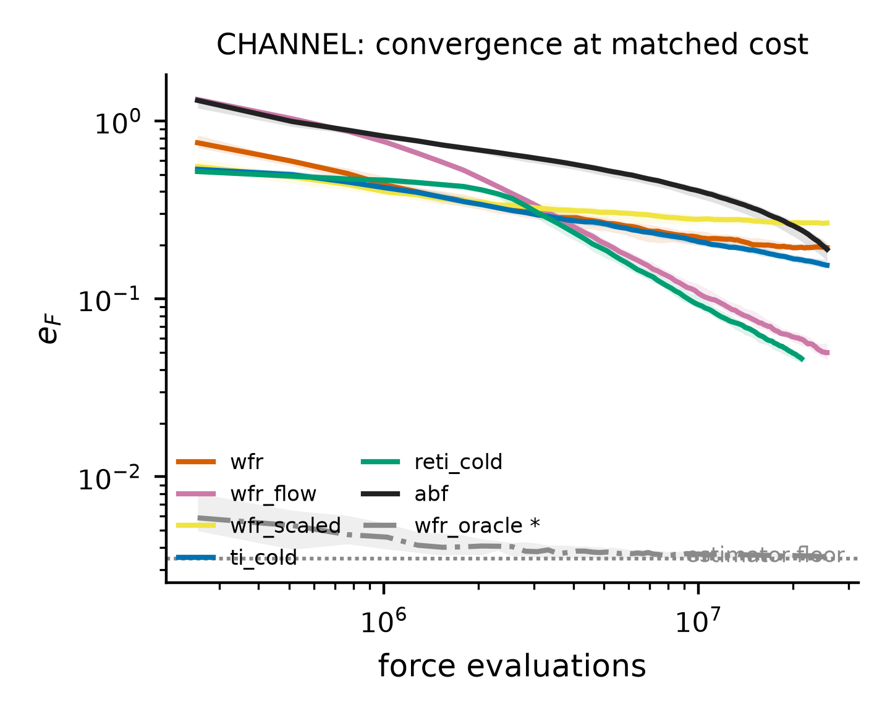
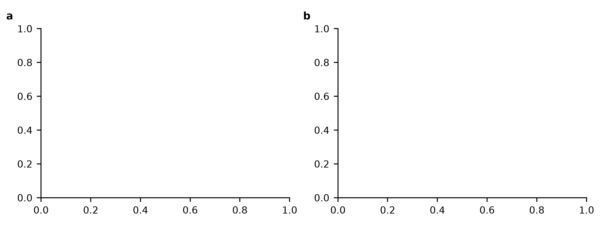

# RC-WFR-TI: what a bias-free reaction-coordinate Wasserstein–Fisher–Rao sampler can and cannot do

*Campaign record, frozen 2026-08-22. Every number is produced by a script in
`scripts/`; the full tables are in [`TABLES.md`](TABLES.md) (machine-generated) and
every measurement in the order it was taken is in [`RESULTS_LOG.md`](RESULTS_LOG.md).
The hypotheses as they were frozen, with outcomes appended, are in
[`PREREGISTRATION.md`](PREREGISTRATION.md).*

---

## 1. The question

The previous campaigns (`ABF-Fisher-Rao`, branch `abp-fisher-rao`) established that a
marginal Fisher–Rao correction is **redundant on top of adaptive biasing**: the adaptive
bias already owns the reaction-coordinate marginal, so FR either repeats what the bias is
doing or cannot see the problem that remains. The natural response is to remove the
adaptive bias entirely and let a **Wasserstein–Fisher–Rao** flow own the marginal
outright.

Let `nu(dq) = Z^-1 exp(-beta V(q)) dq` be the canonical measure, `z = xi(q)` the reaction
coordinate, and disintegrate

```
nu(dq) = exp(-beta F(z)) dz  nu^xi(dq | z),      F'(z) = E_{nu^xi(.|z)}[ f(Q) ].
```

RC-WFR targets the **artificial** joint law `nubar(dq,dz) = u(z) dz nu^xi(dq|z)`:
uniform coverage of `z`, correct physical conditional inside every fiber. One outer
iteration is

```
conditional MD on Sigma(z)  ->  W transport of z  ->  lift  ->  FR reallocation  ->  TI
```

with `F` recovered by thermodynamic integration of the conditional mean force. No bias
potential is ever estimated. The marginal flow is the WFR gradient flow of `KL(p||u)`,

```
d_t p = kappa * Lap(p)  -  lambda * p * ( log p - E_p log p ),
        \___ W ____/      \_________ FR __________________/
```

with `theta = 1 - exp(-lambda dtau)` the exact finite-time FR step. See
[`METHOD.md`](METHOD.md) for the full construction.

**Preregistered question:** *can a bias-free reaction-coordinate WFR sampler compute free
energies faster than adaptive biasing — and than classical stratified thermodynamic
integration?*

---

## 2. Protocol

Three things make the comparison mean something, and each of them changed a conclusion
during the campaign.

**Cost currency.** Every arm carries the same `N` replicas for the same `n_steps`, each
step evaluating the force once per replica, so total force evaluations match by
construction. Replica-exchange energy evaluations are charged and RE-TI's inner loop
shortened to compensate (its budget matches to <2%). W steps, FR resampling, KDE/GMM fits
and the TI quadrature are free in this currency; wall clock is reported separately.

**Estimator floor.** All arms — including ABF — share one binned mean-force estimator, so
no comparison is contaminated by an estimator asymmetry. That estimator has a
**systematic** floor from kernel smoothing of a curved `F'`, scaling as `bw_mf^2` and
*not* decreasing with more samples. Measured by pushing 2^24 i.i.d. oracle samples through
the same pipeline:

| grid G | 181 | 361 | 721 | 361 | 361 | 721 |
|--------|-----|-----|-----|-----|-----|-----|
| `bw_mf` | 0.07 | 0.07 | 0.07 | 0.04 | 0.02 | 0.01 |
| floor `e_F` | 0.0444 | 0.0438 | 0.0436 | 0.0152 | **0.0040** | 0.0009 |

The campaign's own first comparison was run at `bw_mf = 0.07`, where every stratified arm
was sitting *on* the floor and their differences carried no information. Frozen at
`G = 361`, `bw_mf = 0.02`. No claim is made about differences at or below the floor.

**Calibration discipline.** Each arm's own knobs were screened on separate seeds and
frozen before the confirmation runs, with the **baselines screened at least as hard**:
RE-TI over 12 window-count × exchange-period configurations (which changed its result by
25%), ABF over its ramp, SHUS over six decades of gain. Confirmation runs use 32 fresh
seeds at a base no screen used.

**Endpoints.** `I_F` = budget-normalized integrated gauge-optimal L2 free-energy error
(accuracy); `e_F` at full budget; `chan` = L1 error of the realized hidden-channel
occupancy against the reference; coverage; ancestry ESS. Comparisons are paired median
relative changes with 95% bootstrap CIs.

---

## 3. Verdict

**Against adaptive biasing: yes, in a regime identifiable in advance.**
**Against classical stratification: it depends on the fiber.**

Two things had to be got right before the method could be judged at all, and both were
found by the campaign rather than assumed:

1. **The stochastic Wasserstein step is the wrong one.** Replacing
   `Z <- Z + sqrt(2 kappa dtau) eta` by the deterministic probability flow
   `Z <- Z - kappa dtau grad log p_hat(Z)` changes the error by up to an order of
   magnitude, because the flow velocity vanishes as `p -> u`: its hysteresis
   self-annihilates instead of persisting.
2. **Deterministic transport and FR resampling are incompatible** without a small
   resample–move jitter. Clones follow identical trajectories and the ensemble collapses
   (coverage 0.33–0.44). The jitter window is narrow: `sigma = 0.01` optimal on a
   3.6-wide domain, `sigma = 0.05` costs a factor 6.

With both fixed (all figures paired median relative change in `I_F`, 32 fresh seeds,
matched force evaluations; **bold** = 95% CI excludes zero):

| comparison | result |
|---|---|
| vs **ABF**, hidden-channel fiber | **−82.4%** [−85, −73] |
| vs **cold-start RE-TI**, hidden-channel fiber | **−50.1%** [−55, −14] |
| vs **cold-start stratified TI**, hidden-channel fiber | **−70.5%** [−75, −50] |
| vs **ABF**, easy fiber | **−62.6%** [−66, −58] |
| vs **stratified TI**, easy fiber, no fiber model | +40.5% [+29, +54] |
| vs **stratified TI**, easy fiber, exact analytic lift | **−36.1%** [−40, −34] |
| vs **ABF**, long torsional CV (`L = 24`) | **−89%** (0.0224 vs 0.198) |
| vs **stratified TI**, long torsional CV (`L = 24`) | **−12%** (0.0224 vs 0.0254) |
| vs **RE-TI**, long torsional CV (`L = 24`) | +57% (0.0224 vs 0.0142) |
| vs **ABF**, short torsional CV (`L = 3`) | +191% [+163, +209] |
| vs **SHUS / ABP** | better by 1–2 orders of magnitude everywhere tested |
| vs oracle-initialized TI / RE-TI | worse (they use information nobody has) |

### 3.1 The structural limitation

> Any move that changes `xi(q)` without knowing `F` cannot be Metropolis-corrected,
> because the acceptance ratio for the target `u(z) nu^xi(dq|z)` contains
> `exp(+beta F(xi(q)))`. Replica exchange escapes this by swapping between two
> **occupied** windows, where the unknown weights cancel identically. RC-WFR instead
> moves unconditionally and does not correct — buying CV transport at the price of a
> hysteresis bias set by `kappa * tau_fiber` summed over **every** fiber mode it drags,
> including the slowest one, which is precisely the mode that made physical CV transport
> slow to begin with.

Using the running estimate `F_hat` in the acceptance restores exactness only
asymptotically and turns the method back into adaptive biasing — it is then an
expanded-ensemble scheme whose weights *are* the free energy.

So RC-WFR converts a **convergence** problem into a **bias** problem. More compute fixes
the first and not the second. The deterministic flow mitigates this but does not repeal
it: the bias is still extensive in the number of dragged fiber modes, which is why RC-WFR
falls *further* behind RE-TI as the fiber grows (§6.2).

The one component entirely free of the problem is **Fisher–Rao**: selection copies a
walker together with its fiber configuration and drags nothing, so it reallocates
population at zero hysteresis cost. That is why the best configurations use a *small*
`kappa` and a *large* `theta` — minimum dragging, maximum birth–death. The sharpest form:
on the hidden-channel system RC-WFR **with** FR beats cold-start replica exchange by
50.1%; the identical arm **without** it loses to replica exchange by 27.5%.

---

## 4. Mechanism: W discovers, FR establishes

Before any free energy was computed, the particle operators were checked against the WFR
PDE they are supposed to realize (`scripts/phase0_marginal.py`, N = 65536, bandwidth
0.03, comparing against the PDE solution smoothed by the same kernel).

| arm | `KL(T)` particle | `KL(T)` PDE | median rel. dev. |
|-----|-----------------:|------------:|-----------------:|
| W only | 0.33314 | 0.33377 | **0.28%** |
| W + FR | 0.00026 | 0.00014 | **3.8%** |
| FR only | 0.37733 | 0.00099 | 320% (expected) |

The FR-only mismatch is the point, not a bug: the Eulerian density is positive everywhere,
while particles cannot move mass to where there are none. Its support width was unchanged
to four decimals over 500 events at bandwidth 0.20 *and* 0.02.



**The complementarity is quantitative.** Time to reach `KL < 0.05` scales as `L^2` for
Wasserstein alone (ratios 4.4, 4.05, 4.00) and as `L` for W+FR (2.08, 1.89, 2.02): a
reaction–diffusion front of speed `~2 sqrt(kappa lambda)` replacing diffusive relaxation.
FR alone never converges. This is what predicts an advantage over ABF that *grows* with
CV domain length, since ABF's CV equilibration is also diffusive.

The mechanism survives into the free-energy setting: `wfr` (0.0361) beats `w_only`
(0.0765) and `fr_only` (1.037, coverage 0.067), and removing FR from the best variant
costs a factor 2.4 on `EB` and 2.5 on `CHANNEL`. Both halves are necessary.

---

## 5. The lift is the whole problem

Give RC-WFR an **oracle** lift — redraw the fiber configuration from the exact conditional
after each move — and it sits at 1.0–1.1× the estimator floor at every transport rate from
`kappa = 0.03` to `8.0`, on both systems. The WFR flow carries no intrinsic bias.

Replace the oracle by the only lift actually implementable — carry the configuration
across unchanged — and a systematic floor appears that grows monotonically with `kappa`
(3.3× → 28× the floor over `kappa = 0.03 → 2.0`) and that more compute does not remove. It
is also **independent of `n_cond`**: 5, 20 and 100 conditional steps per move give the same
`e_F` to two significant figures. It is a steady-state hysteresis, not a post-jump
transient, so relaxing longer after each move does not help.



**A model-based lift only repairs the modes it models.** Rescaling the fiber coordinate by
`omega(x)/omega(x')` is exact for a harmonic fiber and restores RC-WFR to 1.5× the floor,
making it the best non-oracle arm on `EB`. On a fiber whose slow mode is *which channel is
occupied* — a mode the model does not contain — the same lift makes the error 1.1–1.7×
**worse than doing nothing**, because rescaling `y` distorts the channel minima at `y = ±c`.

| `kappa` | 0.03 | 0.125 | 0.5 | 2.0 | 8.0 |
|---------|-----:|------:|----:|----:|----:|
| `CHANNEL`, identity lift | 0.128 | 0.184 | 0.246 | 0.245 | 0.335 |
| `CHANNEL`, scaled (model) lift | 0.143 | 0.267 | 0.372 | 0.411 | 0.396 |

A lift built from a local model repairs what one already understands and can damage what
one does not — which is, by construction, what made the problem hard.

**Fast CV transport and correct conditional sampling are in direct conflict.** On the
hidden-channel system RC-WFR's channel error *grows* with its own transport rate (0.12 at
`kappa = 0.03` to 0.45 at `kappa = 8`): walkers are dragged through the switch region
faster than the slow mode can equilibrate. Hence small `kappa` plus strong FR.

---

## 6. Head to head

Nineteen arms, one budget. Full tables with CIs: [`TABLES.md`](TABLES.md) T1 and T2.



### 6.1 The two systems

**`EB` — entropic bottleneck**, `V = H(x^2-1)^2 + omega(x)^2 y^2 / 2` with a stiff neck at
the barrier top. Unimodal, fast fiber; a 23.2 `kT` enthalpic barrier. Here plain
cold-start stratified TI wins: it has no transport, so it has no lift bias. Model-free
RC-WFR beats ABF by 62.6% and loses to TI by 40.5%; given an exact analytic lift it beats
every non-oracle baseline by 31–83%.

**`CHANNEL` — hidden two-channel fiber.** The correct occupancy `P(y>0|x)` runs 1 → 0
across the domain and the channels interconvert only near a gateway at `x = 0`. Measured
sign-change time at fixed `x`: 0.025 at `x=0`, 0.15 at 0.3, 16.7 at 0.6, 83.3 at 1.2,
against a budget of `T = 100`. A cold, immobile window started in one channel is stuck.

| arm | `I_F` | `e_F` | × floor | chan | vs RE-TI cold |
|---|---:|---:|---:|---:|---|
| RC-WFR, oracle lift \* | 0.00377 | 0.00359 | 1.0 | 0.032 | **−97.2%** |
| RE-TI, warm start \* | 0.01015 | 0.00636 | 1.8 | 0.031 | **−92.4%** |
| stratified TI, warm start \* | 0.01066 | 0.00582 | 1.7 | 0.030 | **−91.7%** |
| **RC-WFR, flow + FR** | **0.06519** | 0.03862 | 11.2 | 0.040 | **−50.1%** [−55, −14] |
| RC-WFR, flow + count balancing | 0.07804 | 0.03581 | 10.4 | 0.051 | **−40.7%** [−55, −20] |
| RE-TI, cold start | 0.13122 | 0.03954 | 11.4 | 0.030 | — |
| RC-WFR, flow, **FR removed** | 0.16549 | 0.05982 | 17.3 | 0.056 | **+27.5%** [+23, +33] |
| stratified TI, cold start | 0.21816 | 0.15432 | 44.6 | 0.299 | +68.8% |
| RC-WFR, SDE + FR | 0.23933 | 0.19399 | 56.1 | 0.168 | +82.3% |
| ABF | 0.39734 | 0.18966 | 54.8 | 0.059 | +199.0% |
| SHUS / ABP | 2.52239 | 0.35457 | 102.5 | 0.033 | +1817% |

`\*` uses oracle information; upper bounds, not usable methods.

**This is the campaign's headline positive.** On a fiber whose slow mode has a localized
gateway, the probability-flow RC-WFR beats tuned cold-start Hamiltonian replica-exchange
TI by 50.1%, cold-start stratified TI by 70.5% and ABF by 82.4%, all with CIs excluding
zero, at matched force evaluations, against baselines screened at least as hard.



The bias floor is visible as a plateau: the stochastic-step arm flattens out while the
exact methods descend past it, and the probability-flow arm keeps descending because its
transport shuts itself off as the marginal flattens.

---

## 7. Scaling: one prediction confirmed, one falsified



### 7.1 P1 — advantage over ABF grows with CV domain length: **confirmed**

Periodic torsional landscape, wells at fixed spacing, identical local physics at every `L`
([`TABLES.md`](TABLES.md) T3):

| `L` | wells | RC-WFR vs best ABF | RC-WFR vs best stratified TI |
|----|------:|--------------------|------------------------------|
| 3  | 2 | +191.3% [+163, +209] | +164.9% [+95, +269] |
| 6  | 4 | −19.1% [−37, +20] (tie) | +95.8% [+61, +119] |
| 12 | 8 | **−72.2%** [−75, −58] | +39.9% [+26, +94] |
| 24 | 16 | **−82.5%** [−86, −79] | +31.4% [+9, +67] |

Exactly the `O(L)` vs `O(L^2)` crossover the marginal argument predicts. Stratified TI
also degrades with `L` at fixed budget — it needs `M ~ L` windows for fixed CV resolution,
so samples per window fall like `1/L` — and RC-WFR closes on it steadily.

Those RC-WFR entries are **conservative**: the scan fixed `bw_kde = max(0.10, L/60)`, far
too coarse at large `L`. Screened properly at `L = 24`, RC-WFR reaches `I_F = 0.02237`,
**12% better than the best stratified TI (0.02540)** and 89% better than the best ABF
(0.198), though still 57% behind RE-TI (0.01423). That screen also shows the probability
flow is **not universally** the better W step: on this long torsional domain the stochastic
step at moderate `kappa` wins (0.02237 vs 0.02792). The flow's advantage is specific to
regimes where residual hysteresis dominates; where transport itself is the bottleneck, the
SDE's larger effective step wins.

### 7.2 P2 — advantage over replica exchange grows with system size: **falsified**

Exchange acceptance decays only slowly with fiber size (0.975 → 0.814 over
`m_spec = 0 → 512`), while RC-WFR's lift bias is extensive in dragged modes, so the gap
widens instead of closing: +33% → +270% worse than RE-TI ([`TABLES.md`](TABLES.md) T4).
The hoped-for crossover does not exist in this family.

---

## 8. What the controls say

| control | outcome |
|---|---|
| **W + FR vs each half alone** | holds. Removing FR costs 2.4× (`EB`) and 2.5× (`CHANNEL`); W alone is 5–6× worse than the pair; FR alone never leaves the starting region (coverage 0.067). |
| **Smooth FR vs count balancing** | **rejected.** Ties three separate times: 0.03502 vs 0.03612 (`EB`, SDE); 0.01504 vs 0.01513 (`EB`, flow); 0.07804 vs 0.06519 (`CHANNEL`, flow). |
| **FR vs matched-turnover sham** | holds. The sham — same timing and intensity, random direction — is 2.3× worse. |
| **GMM score vs KDE score** | equal. With enough components the mixture reproduces the KDE arm exactly (0.01381 vs 0.01366) at the same wall clock, giving analytic `p` and `grad log p` with no grid differentiation. Not a drop-in, though: it needs its own `K` and `kappa`, and `K = 8` was catastrophic rather than merely inaccurate (the score drove the whole ensemble into the walls). |
| **Deterministic flow from one structure** | fails. The score of a delta ensemble vanishes at the particles, so the ensemble never moves: coverage stayed at 0.02 for every `kappa` and `theta` tested. A brief stochastic phase, or any spread in the initial ensemble, fixes it. |

So the *direction* of the reallocation matters and its Fisher–Rao geometry does not. This
reproduces the ABF/ABP campaign's result in a setting with **no adaptive bias to be
redundant with**, which strengthens it: the tie is a property of the uniform target, not
of the host method.

---

## 9. Where this leaves the idea

| condition | RC-WFR |
|---|---|
| CV domain long relative to physical CV diffusion | beats ABF, margin grows with `L` |
| High enthalpic or entropic barrier the bias must learn | beats ABF and SHUS decisively |
| Fiber slow mode with a localized switch region | **beats cold-start RE-TI by 50%, stratified TI by 70%, ABF by 82%** — small `kappa`, strong `theta`, flow step |
| Fiber has an exact, cheap analytic lift | beats cold-start stratified TI by 36% |
| Easy unimodal fiber, short CV domain | loses to stratified TI and to ABF |
| System size grows | loses further; the bias is extensive in fiber modes |
| Only one starting structure available | the flow form cannot start at all |

> **Reaction-coordinate WFR is a grid-free, continuum alternative to stratified
> thermodynamic integration whose CV transport is unconditional and therefore biased by
> exactly the fiber modes it drags. Its Fisher–Rao half is hysteresis-free and does most
> of the useful work; its Wasserstein half should be run deterministically and gently.**

### 9.1 What would have to be true for the method to be general

A lift that is asymptotically exact **without knowing `F`**. Four kinds were tried and
none qualifies:

1. the oracle — not implementable;
2. a model-based rescaling — repairs only modelled modes, damages unmodelled ones;
3. annealing `kappa -> 0` — removes the bias only by removing the transport, converging to
   stratified TI (it cuts `e_F` from 0.185 to 0.069–0.099 on `CHANNEL`, still 20–28× the
   floor and still worse than cold-start RE-TI);
4. the deterministic probability flow — self-annihilating, the best variant found, but
   still extensive in dragged modes.

Any fifth candidate must supply the missing `exp(+beta F)` weight from somewhere other
than an estimate of `F`, and the only known mechanism that does is exchange between
occupied windows.

### 9.2 Two directions the campaign did not close

* **A hybrid.** Use RC-WFR's front to establish coverage, then hand the resulting
  configurations to exact RE-TI. The two mechanisms are complementary — RC-WFR is fast
  and biased, RE-TI is exact and slow to mobilize — and RC-WFR's annealed variant is
  already a crude version of this.
* **Variance-optimal targets.** Everything here targets `u(z)` uniform, which allocates
  computation evenly rather than where the mean-force variance is. That is an *allocation*
  question, entirely separate from the *bias* question, and the FR machinery carries any
  target at no extra cost.

### 9.3 What was not attempted, and why

No molecular system (WCA dimer, alkanes, alanine) was run. The toy campaign answered the
gating question, and §5 says a hand-built lift is unreliable exactly where it would matter
— so a molecular implementation should be scoped against that finding rather than assumed.
The specific thing to establish first in any molecular port is the **lift ratio**
`tau_cond_needed / tau_transport_under_optimal_bias`; RC-WFR can only win where it is
small.

---

## 10. Reproducibility

```bash
pip install -e ".[dev]"
python -m pytest -q                      # 20 engineering tests, ~40 s on one GPU
python scripts/phase0_marginal.py        # marginal operators vs the PDE
python scripts/confirm.py --system CHANNEL --steps 100000 --seeds 32
python scripts/make_tables.py            # regenerate docs/TABLES.md
python figures/make_figures.py           # regenerate figures/*.png + *.pdf
```

Arms in a comparison share `N`, `n_steps`, the estimator, the initial ensemble and the
seed base, so all comparisons are paired; RE-TI's exchange energy evaluations are charged
to its force budget and its inner loop shortened to match. Every claim is quoted against a
measured estimator floor and no difference at or below that floor is claimed.

Wall clock is reported separately: RC-WFR's marginal machinery costs about 1.5× the wall
clock of stratified TI in these toys (29–32 s vs 19–20 s per run), where a "force
evaluation" is a two-term polynomial. In any real system the force cost dominates and that
overhead vanishes.

Ported numerics and the prior carried over from the closed ABF/ABP campaigns are recorded
in [`PROVENANCE.md`](PROVENANCE.md).
