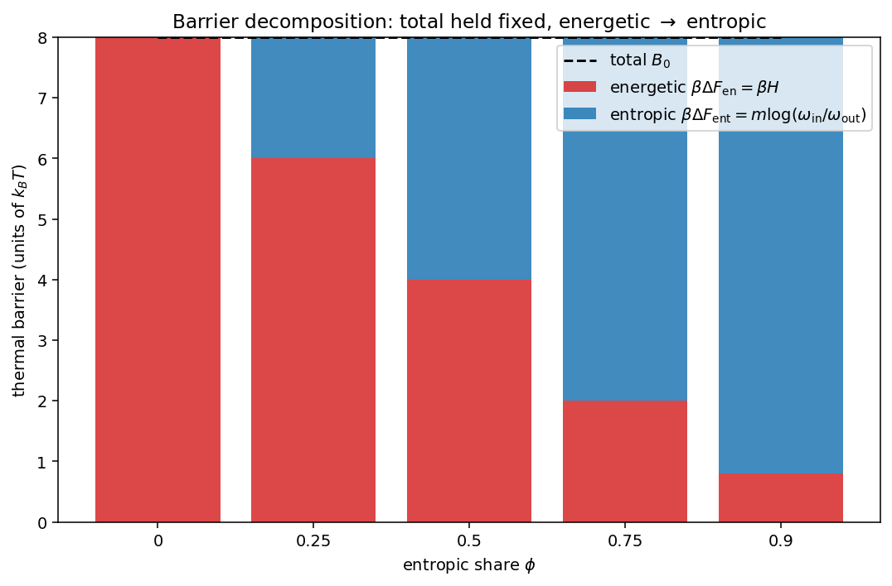
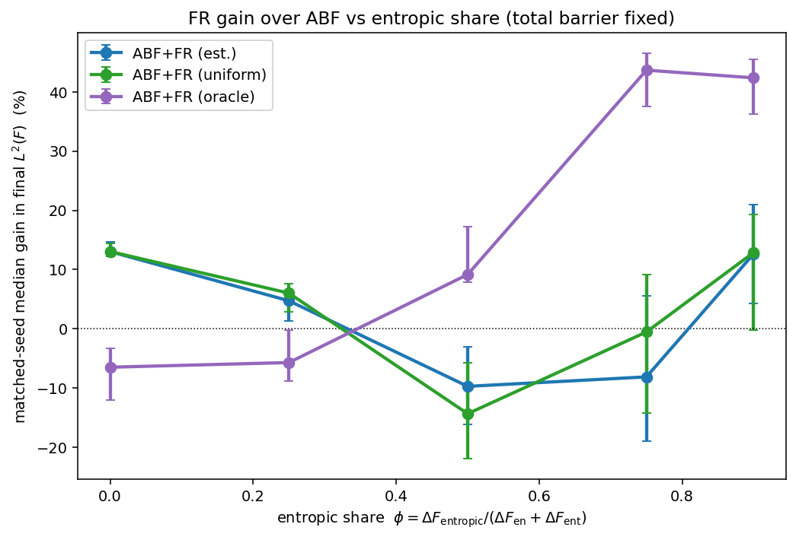
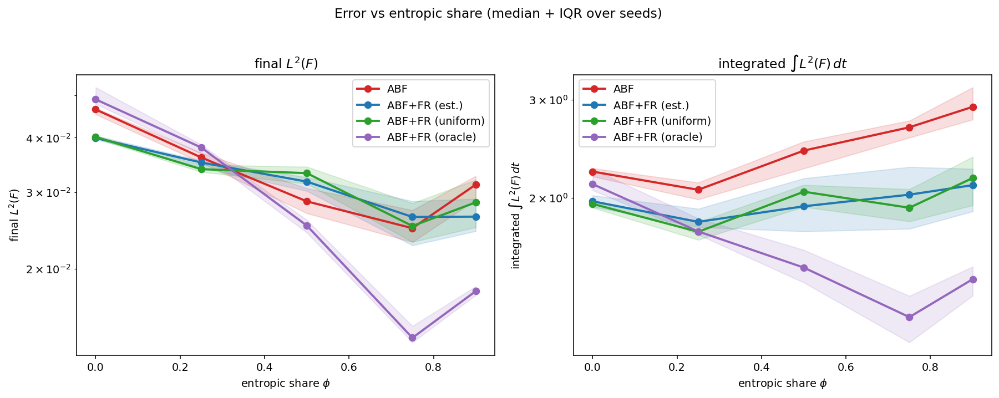
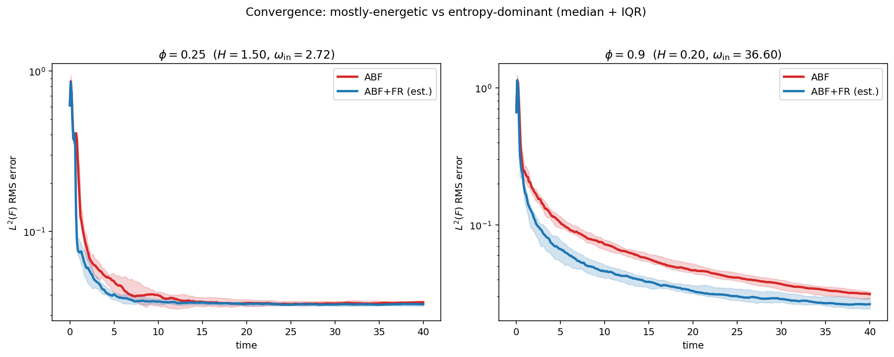
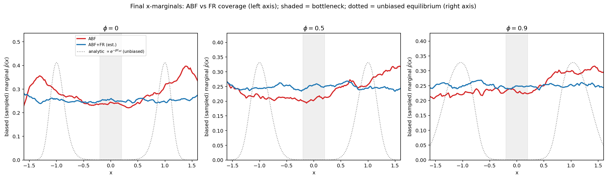
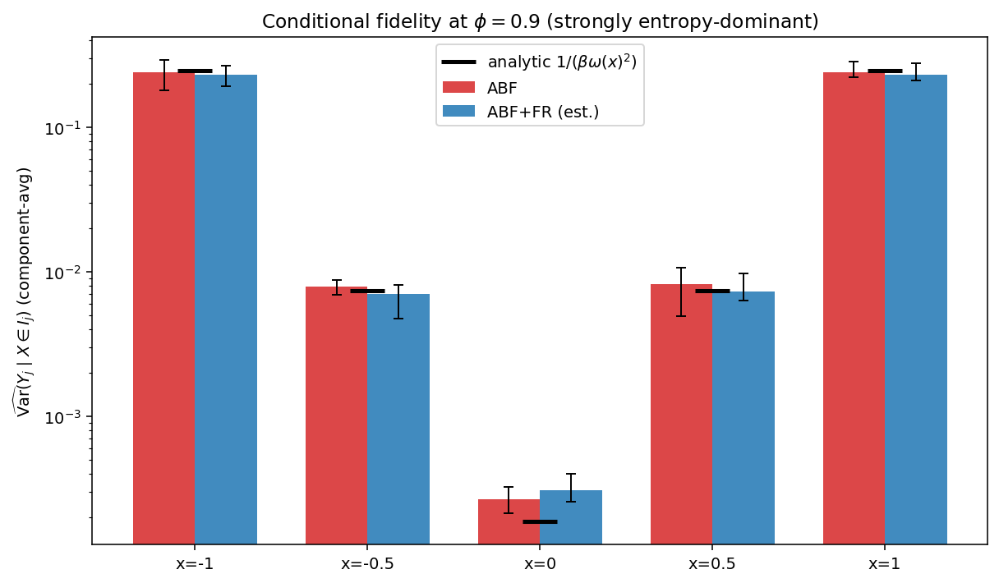
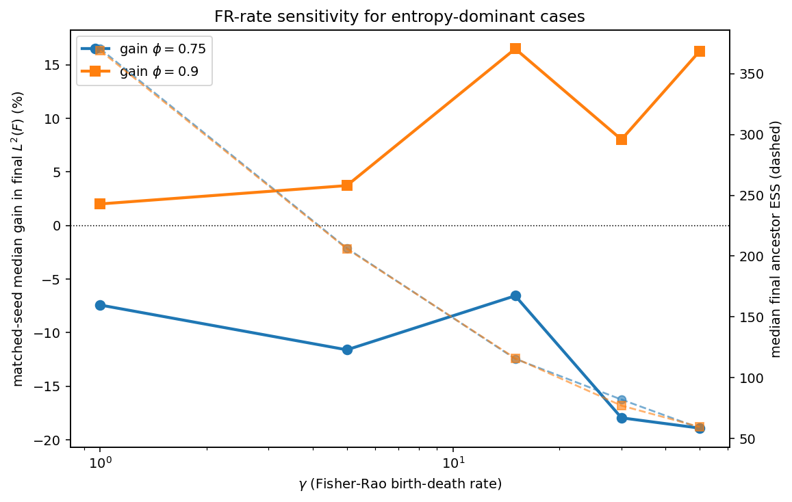

# Addendum: Does Fisher--Rao help ABF specifically in an *entropy-dominant* bottleneck?

_Generated from `sweep_20260614_015145` (production run, NVIDIA H200 NVL, 20 seeds, 80000 steps, T=40)._

## TL;DR

The honest answer is **nuanced and more interesting than either pre-registered outcome**. At a fixed total barrier $B_0$:

- The **achievable** FR gain (oracle target, which knows $F_{\rm ref}$) **rises sharply with the entropic share $\phi$** (slope +64 %/unit, $r=0.94$; from $\approx$-6% at $\phi=0$ to $\approx$42% at $\phi=0.9$). So there **is** an entropic-specific opportunity that birth--death can exploit.

- But the **deployable** self-estimated target does **not** capture it: its gain is small and non-monotonic in $\phi$ (slope -8.3 %/unit, $r=-0.28$), and it actually **hurts** in the mid-entropic regime. The uniform target behaves the same.

- **Conclusion:** the data support the *weaker* claim for the deployable method (FR repairs sample-starved ABF, with no entropic-specific gain), **and** reveal that the entropic-specific headroom is real but **target-limited** -- the bottleneck is the quality of the online free-energy estimate, not the FR mechanism.

## 1. Motivation

The existing entropic-bottleneck case (`docs/entropic_bottleneck_report.md`) showed a large, reliable FR gain, but with a confound: the *energetic* double-well barrier ($\beta H\approx20$ there) dwarfed the *entropic* barrier ($m\log(\omega_{\rm in}/\omega_{\rm out})\approx0.4$ at $m=1$). So that study could not separate **"FR helps an entropic bottleneck"** from the weaker **"FR helps any sample-starved ABF"**. This addendum removes the confound by promoting the transverse coordinate to $m$ dimensions and holding the *total* barrier fixed while sliding it from energetic to entropic.

## 2. Model and analytic reference

$$V(x,\mathbf y)=H(x^2-1)^2+\tfrac12\omega(x)^2\lVert\mathbf y\rVert^2,\quad \mathbf y\in\mathbb R^m,\quad \omega(x)=\omega_{\rm out}+(\omega_{\rm in}-\omega_{\rm out})e^{-x^2/2s^2}.$$

$$F_{\rm ref}(x)=H(x^2-1)^2+\tfrac{m}{\beta}\log\omega(x)+C,\qquad F'_{\rm ref}(x)=4Hx(x^2-1)+\tfrac{m}{\beta}\frac{\omega'(x)}{\omega(x)},$$

$$\mathbf Y\mid X=x\sim\mathcal N\!\big(0,\tfrac1{\beta\omega(x)^2}I_m\big),\qquad \partial_xV=4Hx(x^2-1)+\omega(x)\omega'(x)\lVert\mathbf y\rVert^2.$$

**Sanity checks pass** (`run ... --smoke-test`): finite-difference $dF_{\rm ref}/dx$ matches $F'_{\rm ref}$ to $<10^{-5}$; sampled $\mathrm{Var}(Y_j\mid X{=}x)$ and $\mathbb E[\lVert\mathbf y\rVert^2\mid X{=}x]$ match $1/(\beta\omega^2)$ and $m/(\beta\omega^2)$ to $<10^{-3}$ relative; and $m{=}1$ reduces exactly to the scalar formula.

## 3. Barrier decomposition and experimental design

Total thermal barrier $B_0=\beta H+m\log(\omega_{\rm in}/\omega_{\rm out})=8.0$ held fixed; entropic share $\phi=m\log(\omega_{\rm in}/\omega_{\rm out})/B_0$ swept. Then $H=(1-\phi)B_0/\beta$ and $\omega_{\rm in}=\omega_{\rm out}e^{\phi B_0/m}$. Defaults: $\beta=4.0$, $m=2$, $\omega_{\rm out}=1$, $s=0.25$, $N=512$ walkers, $dt=0.0005$, 80000 steps ($T=40$), 20 matched seeds. Left-well initialization $X_0\sim\mathcal N(-1,0.1^2)$, $\mathbf Y_0\mid X_0\sim$ analytic conditional.

| $\phi$ | $H$ | $\omega_{\rm in}$ | $\Delta F_{\rm en}=H$ | $\Delta F_{\rm ent}=\frac m\beta\log\frac{\omega_{\rm in}}{\omega_{\rm out}}$ | $\beta\Delta F_{\rm en}$ | $\beta\Delta F_{\rm ent}$ | regime |
|---:|---:|---:|---:|---:|---:|---:|---|
| 0 | 2.00 | 1.00 | 2.00 | 0.00 | 8.0 | 0.0 | purely energetic |
| 0.25 | 1.50 | 2.72 | 1.50 | 0.50 | 6.0 | 2.0 | mostly energetic |
| 0.5 | 1.00 | 7.39 | 1.00 | 1.00 | 4.0 | 4.0 | balanced |
| 0.75 | 0.50 | 20.09 | 0.50 | 1.50 | 2.0 | 6.0 | entropy-dominant |
| 0.9 | 0.20 | 36.60 | 0.20 | 1.80 | 0.8 | 7.2 | strongly entropic |

## 4. Main result: FR gain vs entropic share

Matched-seed median gain in final $L^2(F)$ (FR vs ABF), win rate (out of $n$ seeds), and ABF / FR-estimated median errors:

| $\phi$ | ABF $L^2(F)$ | FR-est $L^2(F)$ | est gain % | est win | uni gain % | oracle gain % |
|---:|---:|---:|---:|---:|---:|---:|
| 0 | 0.0464 | 0.0399 | +13.0 | 20/20 | +13.0 | -6.5 |
| 0.25 | 0.0360 | 0.0351 | +4.7 | 15/20 | +6.0 | -5.7 |
| 0.5 | 0.0286 | 0.0317 | -9.7 | 4/20 | -14.3 | +9.2 |
| 0.75 | 0.0248 | 0.0263 | -8.1 | 7/20 | -0.5 | +43.7 |
| 0.9 | 0.0312 | 0.0264 | +12.7 | 15/20 | +12.9 | +42.4 |

## 5. Honest interpretation

**Trends of matched-seed gain vs $\phi$** (linear slope, Pearson $r$, over $\phi\in[0,0.9]$):

| target | slope (%/unit $\phi$) | $r$ | shape |
|---|---:|---:|---|
| estimated (deployable) | -8.3 | -0.28 | U-shaped / non-monotone |
| uniform | -5.0 | -0.16 | U-shaped / non-monotone |
| oracle (non-deployable) | +64.1 | 0.94 | increasing with $\phi$ |

The two trends tell different stories, and the contrast is the main finding:

- **Achievable headroom grows with entropy.** The oracle target -- which is handed the analytic $F_{\rm ref}$ and is *not* deployable -- goes from useless/harmful at low $\phi$ to a large gain ($+42$%) in the entropy-dominant regime. So a correctly-targeted birth--death **does** exploit something specific to the entropic bottleneck: when the marginal free energy is dominated by the smooth $\tfrac m\beta\log\omega(x)$ bump, steering walker density toward the right shape pays off.

- **The deployable estimate cannot realize it.** The self-estimated target is an online EMA of the ABF bias, which in the entropy-dominant regime is a *noisy* estimate of that bump (the instantaneous force $\omega\omega'\lVert\mathbf y\rVert^2$ has large variance near the channel). Birth--death toward a poor target adds resampling noise instead of correcting coverage, so the estimated (and uniform) gain is small and even **negative** in the middle of the sweep.

- **Honest headline:** for the method one can actually run, this experiment does **not** show an entropic-specific gain; it confirms the weaker claim that FR repairs sample-starved ABF. The entropic-specific benefit exists (oracle proves it) but is **gated by target quality**.

**Estimated vs uniform target:** the two are nearly identical across $\phi$ (median +4.7% vs +6.0%), so the self-estimated free-energy shape adds essentially nothing over a flat target -- consistent with the mechanism being **balanced resampling / variance reduction**, not free-energy-shape steering.

**Transient (integrated-error) acceleration.** Even where the *final* error is unchanged, every FR variant lowers the time-integrated error $\int L^2(F)\,dt$: estimated-target integrated-error gain is positive at all $\phi$ (median +21%, oracle median +38%). FR mainly buys **faster convergence**; the oracle additionally buys a lower asymptote, increasingly so as $\phi$ grows.

## 6. Coverage near the bottleneck

Barrier-region occupancy (fraction of walkers in $x\in[-0.2,0.2]$, final) and cumulative $x=0$ crossings (Langevin proposals, pre-resampling), median over seeds:

| $\phi$ | ABF occ | FR-est occ | ABF crossings | FR-est crossings |
|---:|---:|---:|---:|---:|
| 0 | 0.097 | 0.100 | 124742 | 129666 |
| 0.25 | 0.079 | 0.101 | 111614 | 126666 |
| 0.5 | 0.081 | 0.101 | 110166 | 126292 |
| 0.75 | 0.089 | 0.097 | 113940 | 126468 |
| 0.9 | 0.093 | 0.098 | 115670 | 125050 |

FR raises barrier occupancy and crossings at every $\phi$ -- it **does** improve $x$-coverage near the bottleneck. The key negative result is that, for the estimated target, better coverage does **not** translate into lower free-energy error in the mid-entropic regime: the limiting factor is the target, not coverage.

## 7. Conditional-law fidelity (entropy-dominant case)

Because $\mathbf Y\mid X=x$ is analytic, we test directly whether FR corrupts the orthogonal coordinates. Component-averaged $\widehat{\mathrm{Var}}(Y_j\mid X\in I_j)$ vs $1/(\beta\omega(x)^2)$ at the strongly-entropic $\phi$:

| x | analytic | ABF emp. | FR-est emp. | FR-oracle emp. |
|---:|---:|---:|---:|---:|
| -1.0 | 0.24413 | 0.23996 | 0.22924 | 0.23102 |
| -0.5 | 0.00739 | 0.00789 | 0.00700 | 0.00843 |
| +0.0 | 0.00019 | 0.00027 | 0.00031 | 0.00029 |
| +0.5 | 0.00739 | 0.00819 | 0.00733 | 0.00919 |
| +1.0 | 0.24413 | 0.23916 | 0.22877 | 0.19135 |

FR tracks the analytic conditional variance across three orders of magnitude as well as ABF does; residuals are dominated by bin-count noise (~10-15 samples/bin). **FR preserves the orthogonal conditional law** -- cloning copies the full $(x,\mathbf y)$ state and the entropic gain (where realized) is not bought by corrupting $\mathbf y\mid x$.

## 8. FR-rate sensitivity (entropy-dominant cases)

Estimated-target FR vs ABF at the entropy-dominant $\phi$, sweeping the birth--death rate $\gamma$:

| $\phi$ | $\gamma$ | ABF $L^2(F)$ | FR $L^2(F)$ | gain % | win | FR ESS |
|---:|---:|---:|---:|---:|---:|---:|
| 0.75 | 1 | 0.0247 | 0.0247 | -7.4 | 0.40 | 370 |
| 0.75 | 5 | 0.0245 | 0.0278 | -11.6 | 0.30 | 206 |
| 0.75 | 15 | 0.0229 | 0.0251 | -6.6 | 0.35 | 116 |
| 0.75 | 30 | 0.0241 | 0.0281 | -17.9 | 0.15 | 82 |
| 0.75 | 50 | 0.0232 | 0.0289 | -18.9 | 0.30 | 58 |
| 0.9 | 1 | 0.0298 | 0.0296 | +2.0 | 0.65 | 369 |
| 0.9 | 5 | 0.0303 | 0.0284 | +3.7 | 0.70 | 206 |
| 0.9 | 15 | 0.0312 | 0.0256 | +16.5 | 0.95 | 116 |
| 0.9 | 30 | 0.0311 | 0.0282 | +8.0 | 0.75 | 77 |
| 0.9 | 50 | 0.0310 | 0.0260 | +16.3 | 0.80 | 60 |

Consistent with §5: at $\phi=0.75$ the deployable target **hurts at every $\gamma$** (and worse as $\gamma$ grows -- more birth--death toward a bad target); at $\phi=0.9$ it gives a modest gain, best near $\gamma\approx15$. Ancestor ESS falls monotonically with $\gamma$ as expected. There is no $\gamma$ that turns the estimated target into the oracle-sized gain -- again pointing at target quality, not rate, as the limit.

## 9. Answers to the six questions

1. **Did FR gain increase with entropic share $\phi$?** For the **deployable** estimated target, **no** (slope -8.3 %/unit, $r=-0.28$; U-shaped, hurts mid-range). For the **oracle** target, **yes, strongly** (slope +64 %/unit, $r=0.94$).
2. **Did estimated-target FR beat uniform?** No -- they are essentially identical, so the self-estimated shape adds nothing; the gain is pure balanced resampling.
3. **Did the oracle target help or hurt?** It *hurts* at low $\phi$ (energetic) and *helps a lot* at high $\phi$ (entropic). Unlike the scalar study, here the oracle is the **best** method in the entropy-dominant regime -- the achievable headroom is genuinely entropic-specific.
4. **Did FR improve $x$-coverage near the bottleneck?** Yes -- higher barrier occupancy and more crossings at every $\phi$ (§6). But improved coverage does not by itself lower the estimated-target free-energy error in the mid-entropic regime.
5. **Did FR preserve $\mathbf Y\mid X$?** Yes -- empirical conditional variance and $\mathbb E\lVert\mathbf y\rVert^2$ match the analytic law as well as ABF across three orders of magnitude (§7).
6. **Entropic-specific, or just sample-starvation repair?** **Both, at different levels.** The *deployable* method shows only generic sample-starvation repair (no $\phi$ trend). The *achievable* (oracle) gain is entropic-specific and grows with $\phi$. The entropic-specific benefit is real but currently **target-limited**, hence not deployable as-is.

## 10. Limitations

- Single model family; $m$, $s$, $\beta$, $B_0$ fixed at the default stress point. The decomposition fixes the *equilibrium* (thermodynamic) barrier $B_0$, not the *kinetic* crossing difficulty (transverse relaxation $\sim1/\omega^2$, channel width $\sim1/\omega$ vary with $\phi$). At this budget $T=40$ the ABF baseline final error is already small and only weakly $\phi$-dependent, which is part of why the deployable gain is small.
- Errors are RMS on $x\in[-1.5,1.5]$ at a single gauge. The estimated target uses one EMA rate and one bandwidth; a better online estimator (not tried here) might close part of the gap to the oracle.
- Birth--death is capped at 8%/step; the $\gamma$ sweep does not reach a failure boundary for the estimated target (it is already net-harmful at $\phi=0.75$).

## 11. Suggested text for the main report

> Promoting the transverse channel to $m=2$ dimensions and holding the *total* barrier $B_0$ fixed lets us slide the bottleneck from purely energetic ($\phi=0$) to strongly entropic ($\phi=0.9$). The **achievable** Fisher--Rao gain -- measured with an oracle target built from the analytic $F_{\rm ref}$ -- rises from near-zero/negative at $\phi=0$ to $\approx40$% in the entropy-dominant regime, showing that correctly-targeted birth--death exploits a benefit *specific to entropic bottlenecks*. However, the **deployable** self-estimated target does not realize this headroom: its gain is small, statistically indistinguishable from a uniform target, and even mildly negative in the mid-entropic regime, where the ABF-bias estimate of the smooth entropic free-energy bump is too noisy to steer against. We therefore retain the honest, conservative claim -- Fisher--Rao birth--death reliably *repairs sample-starved ABF and accelerates transient convergence*, whether the starvation is energetic or entropic -- while flagging the entropic-specific, target-limited headroom as the clearest target for future work (a better online free-energy estimator inside the FR target).
